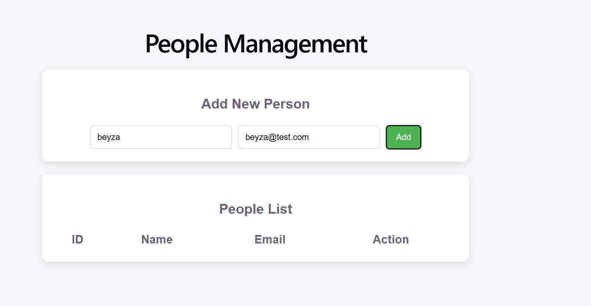
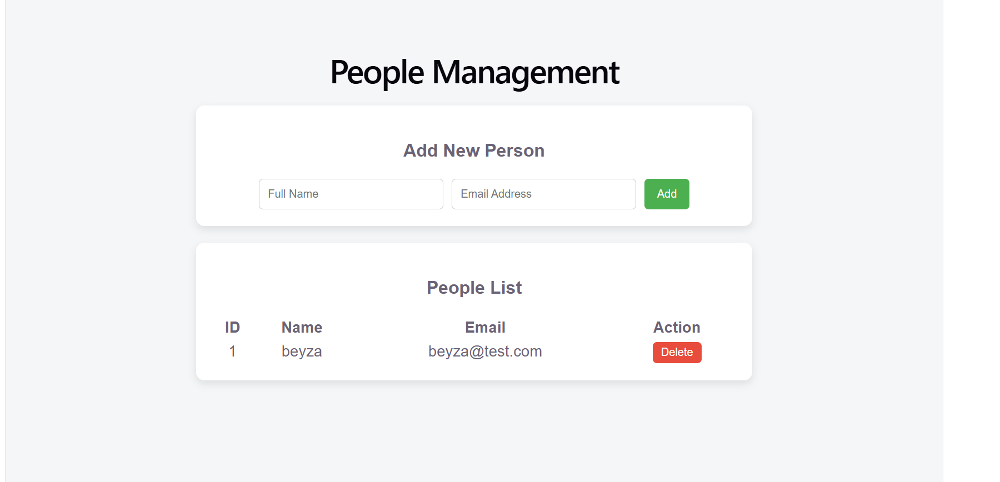
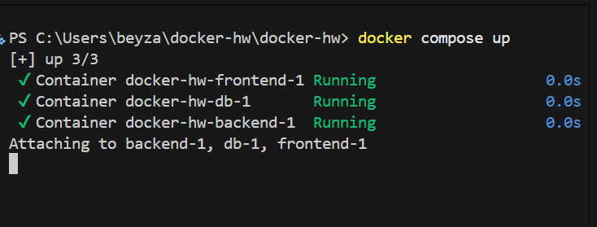

## Student Information

* Name: Beyza Nur Özdemir
* Student ID: 202228402
* Course: SENG 384 – Software Engineering
* Assignment: Docker Full-Stack Application

---

## Project Description

This project is a full-stack web application developed using React, Node.js (Express), and PostgreSQL. The application allows users to manage people by adding, listing, and deleting records.

The entire system runs inside Docker containers and can be started with a single command.

---

## Technologies Used

* Frontend: React (Vite)
* Backend: Node.js (Express)
* Database: PostgreSQL
* Containerization: Docker & Docker Compose

---

## Features

* Add a new person (name & email)
* View all people in a list
* Delete a person
* Full integration with PostgreSQL database
* RESTful API implementation

---

## Project Structure

```
project-root/
│
├── backend/          # Node.js backend
├── frontend/         # React frontend
├── db/               # Database initialization scripts
├── docker-compose.yml
└── README.md
```

---

## How to Run the Project

### Step 1: Clone the repository

```
git clone https://github.com/beyzaxozdemir/SENG384-project.git
cd SENG384-project
```

### Step 2: Run the application

```
docker compose up --build
```

---

## Application URLs

* Frontend: http://localhost:5173
* Backend API: http://localhost:8080/api/people

---

## API Endpoints

* GET /api/people → Get all people
* POST /api/people → Add new person
* DELETE /api/people/:id → Delete person

---

## Screenshots

### Form Page



### List Page



### Docker Running



---

## Notes

* The application uses Docker Compose to run all services together.
* PostgreSQL database is automatically initialized.
* No manual setup is required other than running the Docker command.

---

## Conclusion

This project demonstrates how to build and deploy a full-stack application using Docker. It integrates frontend, backend, and database services into a single, easily runnable system.
